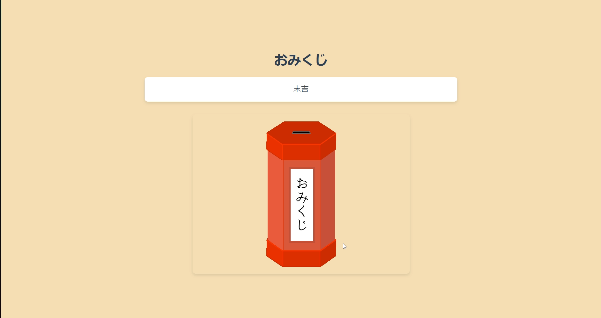

# おみくじ

このプログラムは、JavaScriptを使用しておみくじを引くWebページです。

## スクリーンショット

## 使い方

1. `index.html`ファイルを開きます。
2. ページを読み込むと、自動的におみくじの結果が表示されます。

## ライセンス

This project is licensed under the MIT License - see the [LICENSE.md](LICENSE.md) file for details.